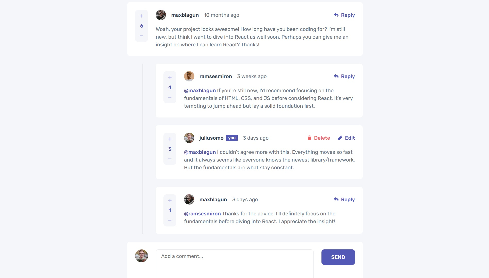

# Frontend Mentor - Interactive comments section solution

This is a solution to the [Interactive comments section challenge on Frontend Mentor](https://www.frontendmentor.io/challenges/interactive-comments-section-iG1RugEG9). Frontend Mentor challenges help you improve your coding skills by building realistic projects.

## Table of contents

- [Overview](#overview)
    - [The challenge](#the-challenge)
    - [Screenshot](#screenshot)
    - [Links](#links)
- [My process](#my-process)
    - [Built with](#built-with)
    - [What I learned](#what-i-learned)
    - [Continued development](#continued-development)
    - [Useful resources](#useful-resources)
- [Author](#author)

## Overview

### The challenge

Users should be able to:

- View the optimal layout for the app depending on their device's screen size
- See hover states for all interactive elements on the page
- Create, Read, Update, and Delete comments and replies
- Upvote and downvote comments
- **Bonus**: If you're building a purely front-end project, use `localStorage` to save the current state in the browser that persists when the browser is refreshed.
- **Bonus**: Instead of using the `createdAt` strings from the `data.json` file, try using timestamps and dynamically track the time since the comment or reply was posted.

### Screenshot

### Links

- Solution URL: [GitHub](https://github.com/hallgatolaszlo/interactive-comments-section)
- Live Site URL: [Vercel](https://interactive-comments-section-snowy.vercel.app/)

## My process

### Built with

- [React](https://reactjs.org/) - JS library
- [Next.js](https://nextjs.org/) - React framework

### What I learned

My goal was to build a simple full-stack web application using Next.js.

I learned about:

- File structures
- App router
- Font and image optimization
- Server and client components
- Fetching data
- Mutating data with React Server Actions
- Error handling
- Accessibility
- Postgresql
- Project deployment with vercel

### Continued development

I'm probably done with this project for now, but there are things that could be added:

- Search and pagination
- Authentication
- Prevent multiple votes from a single user
- Navigation (would have to add profile pages and account settings pages etc.)
- Implement streaming where needed

### Useful resources

- [Next.js official course](https://nextjs.org/learn/dashboard-app) - A nice, short and easily navigable course, where you can build your first full-stack web app using Next.js

## Author

- Frontend Mentor - [@hallgatolaszlo](https://www.frontendmentor.io/profile/hallgatolaszlo)
